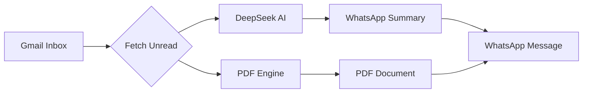

# 📧 Mail to WhatsApp Automation (DeepSeek AI)

[](https://opensource.org/licenses/MIT)
[](https://www.python.org/downloads/)
[](https://www.deepseek.com/)
[](https://developers.facebook.com/docs/whatsapp/cloud-api)

A high-performance Python automation system that bridges your Gmail inbox with WhatsApp. It uses **DeepSeek AI** to distill complex emails into human-readable task lists and forwards the original email as a **pixel-perfect PDF** archive.

---

## 🚀 Key Features

*   🤖 **Smart AI Summaries**: Uses DeepSeek-V4 (Anthropic format) to analyze intent and extract bulleted tasks.
*   📄 **Pixel-Perfect PDFs**: Converts HTML emails into PDFs preserving layout, images, and buttons using **WeasyPrint**.
*   📱 **Multi-Recipient Support**: Broadcasts summaries and documents to multiple WhatsApp numbers simultaneously.
*   🛡️ **Smart Filtering**: Automatically detects informational newsletters and skips task-based formatting.
*   🧹 **Auto-Cleanup**: Temporary PDF files are securely deleted after transmission.

---

## 🛠️ System Workflow



---

## 📋 Installation & Setup

### 1. Clone & Environment
```bash
git clone https://github.com/moinsarwar/mail-to-whatsapp-sender.git
cd mail-to-whatsapp-sender
python3 -m venv venv
source venv/bin/activate  # On Windows: venv\Scripts\activate
pip install -r requirements.txt
```

### 2. Dependencies (Linux/WSL)
For PDF rendering, you need these system libraries:
```bash
sudo apt-get install -y libpango-1.0-0 libharfbuzz0b libpangoft2-1.0-0
```

### 3. Configuration
Rename `.env.example` to `.env` and fill in your keys:
```env
# Gmail (Use App Password)
EMAIL_ACCOUNT="your@gmail.com"
EMAIL_PASSWORD="xxxx xxxx xxxx xxxx"

# DeepSeek
DEEPSEEK_API_KEY="sk-..."

# Meta WhatsApp
META_ACCESS_TOKEN="EAA..."
META_PHONE_NUMBER_ID="10..."
YOUR_WHATSAPP_NUMBERS="923...,923..."
```

---

## 📂 Project Structure

| File | Description |
| :--- | :--- |
| `main.py` | Core orchestrator and execution loop. |
| `mail_handler.py` | Handles IMAP connection and email fetching. |
| `ai_processor_deepseek.py` | DeepSeek AI logic for task extraction. |
| `pdf_generator.py` | HTML-to-PDF engine with WeasyPrint. |
| `whatsapp_sender.py` | Meta Cloud API integration. |

---

## 🤝 Contributing

Contributions are welcome! If you find a bug or want to suggest a feature:
1. Fork the repo.
2. Create a feature branch.
3. Submit a Pull Request.

---

## 📜 License

This project is licensed under the **MIT License** - see the [LICENSE](LICENSE) file for details.

---
Created with ❤️ by [Moin Sarwar](https://github.com/moinsarwar)
